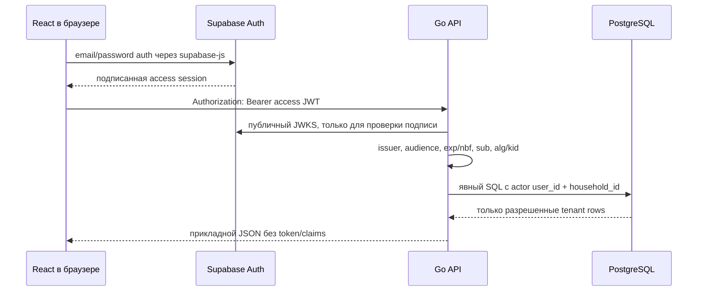

# Аутентификация и семейные пространства — этап 3

Этот документ фиксирует trust boundary и правила доступа до реализации этапа 3.
Финансовые API, импорт backup v5 и прямой доступ frontend к PostgreSQL/PostgREST
не входят в этот этап.

## Trust boundary

React доверяет управление session только официальному `@supabase/supabase-js` и
не хранит отдельную копию access token. Go не доверяет браузеру: identity появляется
в request context только после криптографической проверки JWT. PostgreSQL не знает
JWT и получает локальный actor через проверенный `sub`; каждый tenant-запрос связывает
actor membership и `household_id` непосредственно в SQL.

Frontend использует Supabase только для Auth. Все profiles, households, memberships,
invitations и будущие финансовые данные проходят через Go API. Service-role key
браузеру не передается: он обходит пользовательские политики, является серверным
секретом и превратил бы любой XSS/утекший bundle в полный доступ к проекту. Этап 3
вообще не требует service-role key.

## Маршруты

Публичный маршрут только один:

- `GET /api/health` — состояние процесса и PostgreSQL без внутренних деталей.

Все маршруты `/api/v1` требуют проверенный Bearer JWT:

- `POST /api/v1/session/bootstrap`;
- `GET /api/v1/me`;
- `GET|POST /api/v1/households`;
- `GET|PATCH /api/v1/households/{id}`;
- `GET /api/v1/households/{id}/members`;
- `PATCH /api/v1/households/{id}/members/{userId}`;
- `POST /api/v1/households/{id}/invitations`;
- `POST /api/v1/invitations/accept`;
- `POST /api/v1/households/{id}/invitations/{id}/revoke`.

Missing/malformed/invalid token возвращает одинаковый JSON `401` и
`WWW-Authenticate: Bearer`. Недостаточная роль возвращает `403`. Object endpoint
для чужого и несуществующего household возвращает одинаковый `404`, исключая
tenant enumeration.

## Проверка JWT и JWKS

Решение следует официальным материалам Supabase:
[JWT guide](https://supabase.com/docs/guides/auth/jwts) и
[claims reference](https://supabase.com/docs/guides/auth/jwt-fields).

- разрешены только `RS256` и `ES256`; `none`, HS* и остальные algorithms запрещены
  до разбора claims;
- `iss` и `aud` сравниваются с точными значениями валидированной конфигурации;
- `exp` обязателен, `nbf` проверяется при наличии, clock skew ограничен конфигурацией;
- `sub` обязателен и должен быть UUID;
- `kid` обязателен и ограничен по длине. Выбранный JWK обязан иметь совпадающие
  `kid`, `alg`, `kty`, `use = sig` и `key_ops` с `verify`, если `key_ops` задан.
  Для RS256 принимается только RSA public key, для ES256 — только EC/P-256.
  JWK с private parameters (`d`, RSA primes и CRT parameters) отклоняется целиком;
- размер serialized JWT ограничен; подпись обязательна;
- JWKS client имеет короткий timeout, ограничение body и TTL не более 10 минут;
- неизвестный `kid` может вызвать forced refresh, но не «один refresh на request».
  Все конкурентные fetch объединяются singleflight. После любой попытки действует
  глобальный refresh cooldown, а неизвестные kid попадают в bounded negative cache
  до конца cooldown. Поэтому поток случайных kid не усиливается в N JWKS-запросов.
  После cooldown первый запрос может выполнить один refresh для поддержки ротации,
  для которой Supabase рекомендует заранее публиковать standby key;
- истекший cache никогда не используется при сетевой ошибке: безопасная политика
  fail closed важнее доступности. Последняя валидная копия используется только до
  своего TTL;
- JWKS body, Authorization, JWT, invite token и claims не логируются.

Production требует HTTPS для issuer/JWKS. HTTP разрешается только при явном
`APP_ENV=local|development|test`, чтобы unit-тесты использовали локальный
`httptest` JWKS без внешней сети.

## CORS

`FRONTEND_ORIGINS` — список точных origins вида `scheme://host[:port]`; path,
userinfo, query и wildcard запрещены. При совпадении API возвращает конкретный
`Access-Control-Allow-Origin` и `Vary: Origin`. Preflight `OPTIONS` обрабатывается
до auth middleware, но только для разрешенного origin, методов `GET, POST, PATCH`
и headers `Authorization, Content-Type, Idempotency-Key`. Неразрешенный origin не
получает ACAO и preflight отклоняется. `*` не используется, а
`Access-Control-Allow-Credentials` по умолчанию отсутствует: access JWT передается
явным Bearer header, не ambient cookie.

## Роли и разрешения

| Действие | owner | admin | member |
| --- | --- | --- | --- |
| Читать household и members | Да | Да | Да |
| Переименовать household | Да | Да | Нет |
| Создать invitation `admin/member` | Да | Да | Нет |
| Отозвать invitation | Да | Да | Нет |
| Назначить/понизить owner | Да, кроме последнего active owner | Нет | Нет |
| Менять admin/member | Да | Да, без воздействия на owner | Нет |
| Удалить membership | Да, кроме последнего owner | Да, кроме owner | Только через будущий self-leave flow |
| Создать новый household | Да | Да | Да |

Invitation никогда не назначает `owner`. Admin не может выдать роль выше своей или
изменить owner. Каждая role/status mutation сначала в транзакции берет
`SELECT ... FOR UPDATE` одной и той же строки `households`, затем читает actor,
target и active owners и только потом обновляет membership. Единый порядок блокировки
сериализует конкурирующие изменения: если два owners одновременно понижают/удаляют
себя, второй увидит результат первого и не сможет удалить последнего active owner.

## Жизненный цикл

1. Supabase выполняет регистрацию, вход, refresh и recovery session.
2. `session/bootstrap` идемпотентно сопоставляет проверенный UUID `sub` с локальным
   `users` profile. Email и пароль в локальную БД не копируются.
3. Создание household и owner membership выполняется одной транзакцией.
   `Idempotency-Key` хранится в nullable `households.creation_idempotency_key`;
   partial unique index имеет scope `(created_by_user_id, key)`. Повтор возвращает
   тот же household без повторного audit event.
4. Owner/admin создает bearer invitation с ограниченным TTL и idempotency key.
   `household_invitations.request_idempotency_key` уникален в scope
   `(household_id, invited_by_user_id, key)`. Raw token содержит 32 байта
   (256 бит) из `crypto/rand`, кодируется base64url без padding и возвращается ровно
   один раз; PostgreSQL хранит только 32-байтовый SHA-256 hash. Повтор с тем же key
   возвращает определенный `409 idempotency_replayed` без token: восстановить raw
   значение из hash невозможно и повторно выдавать новый token под тем же запросом
   небезопасно. Replay key сравнивается с нормализованным payload: другое household
   name либо другая invitation role/TTL дает deterministic conflict, а не объект от
   предыдущего запроса. Invitation хранит `ttl_seconds` именно для этой проверки.
5. Аутентифицированный пользователь отправляет raw token только в JSON body.
   Acceptance блокирует строку invitation, создает одну membership и помечает token
   принятым в одной транзакции. Истекший, отозванный, принятый или повторный token
   не работает; два параллельных accept не создают две membership.
6. Invitation можно отозвать до acceptance. Реальная email delivery отсутствует.

Email в invitation не хранится. Это осознанная bearer-invite модель: любой, кто
получил raw token до истечения TTL, может принять приглашение в свою
аутентифицированную учетную запись. Поэтому token нужно передавать отдельным
защищенным каналом; email binding и доставка требуют отдельной PII/verification
модели и отложены.

Raw invitation token принимается только полем JSON body. URL/query, application
logs, audit `changes`, error messages и metrics никогда не содержат token или hash.

## Угрозы и меры

| Угроза | Мера этапа 3 |
| --- | --- |
| Token theft | Короткоживущий access JWT, TLS обязателен в production, token не логируется и не выводится в DOM. |
| Confused deputy | Точные issuer/audience/alg, identity только из проверенного JWT, actor связан с tenant в SQL. |
| IDOR | Composite tenant FK и membership predicate в каждом object query/mutation. |
| Tenant enumeration | Одинаковый `404` для чужого и отсутствующего объекта, списки только active memberships. |
| Replay invitation | Только hash в БД, TTL/revoke/accepted state, row lock и одноразовое acceptance. |
| Token leakage in logs | Логи содержат request ID/method/path/status, но не headers, bodies, token или claims. |
| Privilege escalation | Матрица ролей, запрет owner-invite, блокировка последнего owner, audit mutation. |

## Отложено до production/deploy

- реальный Supabase project, URL и publishable key;
- email confirmation/reset/invitation delivery и production SMTP;
- TLS/reverse proxy, HSTS и сетевые политики;
- distributed multi-replica limiter, proxy per-IP limits и abuse detection;
- усиленная CSP для production frontend;
- production secret store и controlled JWKS cache purge;
- MFA/assurance-level policy, session revocation introspection и RLS;
- финансовые endpoints, importer, banking и recurring generator.
