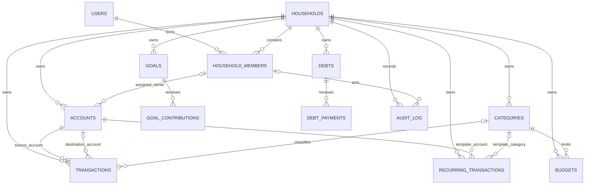

# PostgreSQL-схема v1

Этот документ фиксирует проектное решение этапа 2. Схема создается отдельно от
текущего SQLite-приложения, не читает `finance.db` и пока не используется HTTP API.
Первая версия рассчитана на рублевый учет одного или нескольких household в одном
модульном Go-приложении.

## Инструмент миграций

Выбран [goose](https://github.com/pressly/goose) `v3.24.3`: распространенный Go-инструмент,
который исполняет обычные SQL-файлы с секциями `Up`/`Down`, ведет таблицу
`goose_db_version` и не требует ORM или собственного migration framework. Версия
закреплена в `database/go.mod` как Go tool dependency.

Команды выполняются только с явно переданным `DATABASE_URL`:

```bash
cd database
go tool goose -dir migrations postgres "$DATABASE_URL" up
go tool goose -dir migrations postgres "$DATABASE_URL" status
go tool goose -dir migrations postgres "$DATABASE_URL" down
```

В репозитории нет production-строки подключения. Для локальной разработки подходит
значение из `.env.example`; интеграционные тесты создают отдельную временную базу.

## Таблицы и связи

| Таблица | Назначение |
| --- | --- |
| `users` | Локальный профиль. UUID не зависит от `auth.users`; nullable `auth_subject` оставляет место для будущего внешнего `sub`. |
| `households` | Tenant и единица совместного финансового учета. В v1 валюта фиксирована как `RUB`. |
| `household_members` | Связь пользователя с household, роль и состояние участия. |
| `accounts` | Обычные и накопительные счета, банк, legacy owner label и опциональная привязка к участнику. |
| `categories` | Категории `income`/`expense`; имя уникально без учета регистра внутри household и типа. |
| `transactions` | Доход, расход или перевод как одна запись, совместимая с backup v5. |
| `budgets` | Лимит расходной категории на конкретный календарный месяц. |
| `goals` | Цель, целевая сумма и сумма, накопленная до начала учета contributions. |
| `goal_contributions` | Отдельные пополнения цели; исходная сумма цели от них не переписывается. |
| `debts` | Исходный долг и направление `owe_me`/`i_owe`. |
| `debt_payments` | Частичные возвраты; исходная сумма долга остается неизменной. |
| `recurring_transactions` | Шаблон повторяющейся операции и следующая дата исполнения; генератора пока нет. |
| `audit_log` | Append-only журнал изменений финансовых сущностей. |
| `household_invitations` | Одноразовые bearer invitations этапа 3; хранится только SHA-256 raw token. |
| `goose_db_version` | Служебный учет примененных миграций, создается goose. |

### Unicode-уникальность имен категорий

Уникальность category name нельзя строить на `lower(name)`: результат обработки
кириллицы зависит от `LC_CTYPE`, а кластер с locale `C` не считает `Расход` и
`рАсХоД` одинаковыми. Миграция явно требует ICU provider и создает
недетерминированную коллацию `finance_category_name_ci` с locale
`und-u-ks-level2`. ICU выполняет Unicode-сопоставление с канонической
нормализацией, level 2 сохраняет различие диакритики, но игнорирует регистр.
Перед сравнением применяется `btrim`, поэтому внешние пробелы также не позволяют
создать дубликат. Если PostgreSQL собран без ICU, миграция завершается понятной
ошибкой `0A000`, а не незаметно меняет семантику. Интеграционный тест запускается
на locale `C` и проверяет кириллический регистр и внешние пробелы.

## Tenant-изоляция

`household_id NOT NULL` присутствует во всех финансовых таблицах. Изоляция
поддерживается на уровне базы, а не только `WHERE household_id = ...` в будущем API:

- каждый tenant-owned parent имеет составной `UNIQUE (household_id, id)`;
- transaction ссылается на счета через `(household_id, account_id)` и
  `(household_id, to_account_id)`;
- category reference включает тип операции:
  `(household_id, category_id, transaction_type)` →
  `(household_id, id, category_type)`;
- те же составные связи применены для budget/category, goal/contribution,
  debt/payment и recurring template;
- account owner и audit actor могут ссылаться только на участника того же household.

Поэтому UUID существующего объекта другого household недостаточно для создания
связи: составной FK отклонит запись. RLS намеренно не включена до появления реальной
модели авторизации и правил сессии.

## Доходы, расходы и переводы

- `income`: положительная `amount_cents`, исходный account и income-category;
- `expense`: положительная `amount_cents`, исходный account и expense-category;
- `transfer`: положительная сумма, исходный и отличный от него целевой account,
  category отсутствует;
- баланс account: income прибавляется, expense вычитается, transfer вычитается у
  source и прибавляется у destination;
- transfer не меняет общий баланс household;
- balance adjustment хранится обычной income/expense записью с
  `is_balance_adjustment = true`: она влияет на остаток, но может исключаться из
  аналитики денежного потока;
- `source` ограничен значениями `manual`, `import`, `recurring`, `system`;
- nullable `idempotency_key` уникален внутри household даже после soft delete.

Все суммы — `BIGINT` в копейках с диапазоном от `1` до
`9 000 000 000 000 000` для положительных операций. Нулевые и отрицательные суммы
отклоняются. Первая версия работает только в RUB; счета и household имеют
`currency_code = 'RUB'`. Конвертация и мультивалютные переводы не моделируются.

## Архивирование и soft delete

- изменяемые справочники и агрегаты имеют `archived_at` и/или `deleted_at`;
- transactions, contributions и payments не удаляются при пользовательском
  удалении: выставляется `deleted_at`, а transaction дополнительно хранит
  `deleted_by_user_id` и `deletion_reason`;
- parent FK используют `ON DELETE RESTRICT`, поэтому hard delete account, category,
  goal или debt не может разрушить существующую историю;
- удаление membership заменено состоянием `removed` и `removed_at`;
- `updated_at` обслуживается единым trigger;
- `audit_log` является append-only: UPDATE и DELETE блокируются trigger.

Hard delete остается только административной операцией обслуживания пустых данных
или результатом `Down` migration. Будущий сервисный слой обязан создавать audit
event в той же транзакции, что и изменение финансовой записи.

## Budgets, goals, debts и recurring templates

- budget month хранится первым днем месяца; partial unique index разрешает не более
  одной не удаленной записи для household/category/month;
- budget может ссылаться только на expense-category благодаря составному FK с
  фиксированным `category_type = 'expense'`;
- goal хранит `target_amount_cents` и `initial_saved_cents`; текущий прогресс —
  initial плюс сумма не удаленных `goal_contributions`;
- debt хранит неизменяемую исходную `original_amount_cents`; оплачено и остаток
  вычисляются по не удаленным `debt_payments`;
- recurring template повторяет структурные правила transaction и хранит frequency,
  interval и `next_execution_date`; создание реальных transactions отложено.

## Совместимость с backup v5

Прямо переносятся названия, цвета, account kind, банк, legacy owner label, системные
флаги, типы операций, суммы, даты, комментарии, balance adjustment, цели, долги и
платежи. Требуют преобразования:

- строковые legacy ID → детерминированные UUID с таблицей соответствия;
- все сущности → заранее выбранный `household_id`;
- `owner` сохраняется в `legacy_owner_label`, а привязка к member выполняется только
  при однозначном сопоставлении;
- category `budgetCents` → budget выбранного месяца, потому что backup хранит
  бессрочный месячный лимит, а новая модель — календарный месяц;
- goal `savedCents` → `initial_saved_cents`, без искусственной contribution;
- debt `paidCents`/`leftCents` игнорируются как производные; итог считается по
  `debtPayments`;
- пустые строки дат → `NULL`, timestamps нормализуются в `TIMESTAMPTZ`;
- source импортированных financial records → `import`, currency → `RUB`.

Полное соответствие и проверки баланса описаны в `backup-v5-to-postgres.md`.
Importer на этом этапе не реализуется.

## Намеренно отложено

- Supabase Auth, регистрация, login, JWT middleware и зависимость от `auth.users`;
- RLS и политики доступа;
- приглашения и управление household через UI;
- финансовые HTTP endpoints и основной React UI;
- importer backup v5 и перенос реальных данных;
- банковские интеграции, синхронизация и reconciliation;
- генератор recurring transactions;
- мультивалютность, курсы и конвертация переводов;
- production credentials, deployment и эксплуатационные политики retention.

## ER-диаграмма


